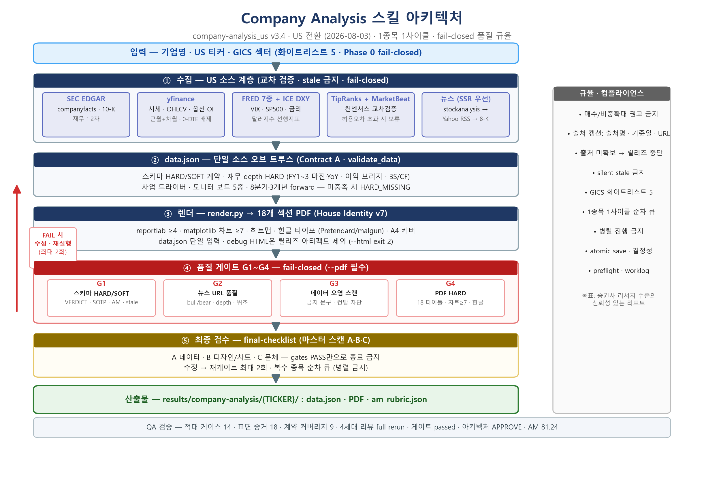

# Agentic Research Pipeline

> **One-Line Pitch:** AI Agent가 실시간 수집·분석·작성하는 한국 상장사 기업분석 리포트 자동화 파이프라인 (v3.0, Agent-Native)

## 📌 Executive Summary

| Category | Details |
| :--- | :--- |
| **Core Objective** | 수작업 기업분석 리포트 병목 제거 + LLM 환각 방지. "AI Agent가 증권사 리서치 애널리스트 수준의 리포트를 직접 작성할 수 있는가" 검증 |
| **Key Architecture** | Agent-Native: `web_search` + `browser` 실시간 데이터 수집 → Phase 0~5 상태 머신 → 템플릿 치환 HTML 리포트 → 자가 검증 게이트. v2 Python 파이프라인(G1~G4 게이트 스크립트)에서 진화 |
| **Performance** | 실제 생성 결과물 6건 (HTML 5 + PDF 2), 커버리지 19개 종목, 섹터 지식베이스 7종, 전 섹션 데이터 출처·수집일 명시 |
| **Tech Stack** | AI Agent (GJC), `web_search`/`browser`, PyKRX/DART API, HTML/CSS 템플릿 엔진, Python (v2 하이브리드) |

---

## 🏗️ Architecture



```
입력 (기업명 / 종목코드)
  │
  ▼
Phase 0  기업 식별·섹터 분류          web_search
Phase 1  핵심 데이터 직접 수집        web_search + browser (주가/재무/RSI/VKOSPI)
Phase 2  경쟁사·산업·뉴스 수집        web_search + 섹터 지식베이스 7종
Phase 3  Bull/Bear 쟁점 직접 분석     LLM 추론 (수치·출처 필수, 금지어 규칙)
Phase 4  HTML 리포트 생성            read(template.html) → write({{PLACEHOLDER}} 치환)
Phase 5  Gate: 자가 검증 체크리스트    생성물 검증 (누락·오류·출처 점검)
  │
  ▼
results/기업명_종목코드/기업명_종목코드_YYYYMMDD.html
```

**Gate 체계 (환각 방지 핵심):**
- v2: Python `gate1~4.py` Fail-Closed 게이트 → v3: **에이전트 자가 검증 체크리스트**로 이관 (검증 로직은 그대로, 실행 주체만 변경)
- 모든 수치는 **출처 + 수집일(YYYY-MM-DD)** 필수 기록, 미확보 시 `"데이터 미확보 (수집일 시도: 사유)"` 명시 — **추측·하드코딩 금지**
- Bull/Bear 리포트는 증권사 출처를 동반한 **사실 기반 논쟁** 형태 (의견·전망 금지어 규칙)

## 📊 Key Results & Validation — 실제 생성 결과물

| 기업 | 종목코드 | 리포트 | 형식 |
|------|----------|--------|------|
| NVIDIA | NVDA | 2026-08-06 | PDF (`sample_output/`) |
| 삼성전자 | 005930 | 2026-07-08 | HTML + PDF |
| 셀트리온 | 068270 | 2026-07-03 | HTML + PDF |
| 두산에너빌리티 | 034020 | 2026-07-03 | HTML (`examples/`) |
| 대한전선 | 001440 | 2026-07-02 | HTML (`examples/`) |

**커버리지 (2026-06~07 기준, 19종목):** 삼성전자, SK하이닉스, 삼성SDI, 현대모비스, 기아, 두산에너빌리티, 대한전선, 대한광통신, 셀트리온, JYP엔터테인먼트, 카카오, 한미반도체, POSCO홀딩스, 한화오션, LG전자, NH투자증권, 한온시스템, LG CNS, NVIDIA

**리포트 구조 (8개 메인 섹션 · 14개 서브 섹션):**

| # | 섹션 | 내용 |
|---|------|------|
| 0 | Executive Summary | 핵심 지표 대시보드 |
| 1 | 정량적 컨센서스 및 이격도 분석 | 20개 하우스 수치 평균·이격도 + 추이 차트 + 주가/투자자 매매동향 |
| 1.8 | 선행데이터 분석 | 섹터 선행지표 (VKOSPI, 환율 등) |
| 1.9 | 파생상품·단기 수급 모니터 | 선물 베이시스/OI, 옵션 풋콜, 대차잔고 |
| 2 | 시장의 지배적 서사 | 증권사 공통 투자포인트 |
| 3 | 하우스별 핵심 이견·논쟁점 | Bull vs Bear 수치 기반 대치 분석 |
| 4 | 리스크 요인 & 캘린더 | 실적 발표, 파생 청산, 리스크 요약 |
| 5 | 종합 판단 및 전술적 제언 | Investment Conclusion |

---

## 🛠️ 저장소 구조

```
docs/
  SKILL.md          # 실행 스펙 (Phase 0~5, 수집 규칙, 금지어)
  template.html     # 단일 디자인 시스템 (재현성 보장)
sample_output/      # 자동 생성 리포트 샘플 (PDF 2 + HTML 5)
examples/           # 추가 생성 결과물
```

**상세 스펙:** `docs/SKILL.md` — Phase별 수집 항목, 수집 규칙, Bull/Bear 형식, 출처 표기 규칙 전체 문서화

---

## License

내부 연구용. 상업적 재배포 시 원저작자 연락 요망.